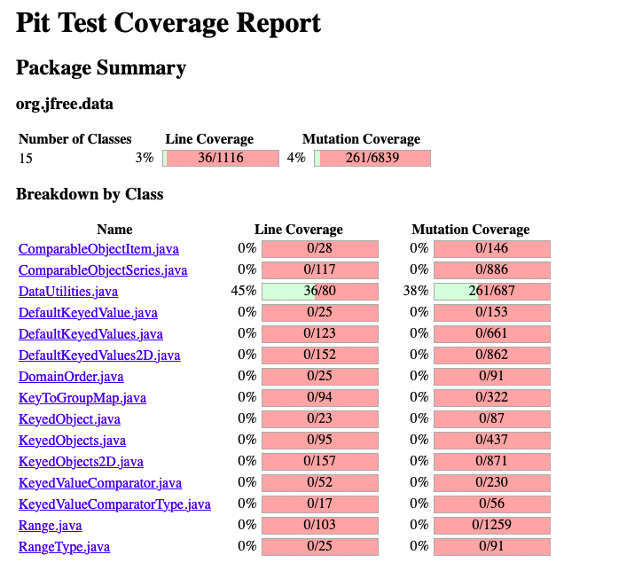
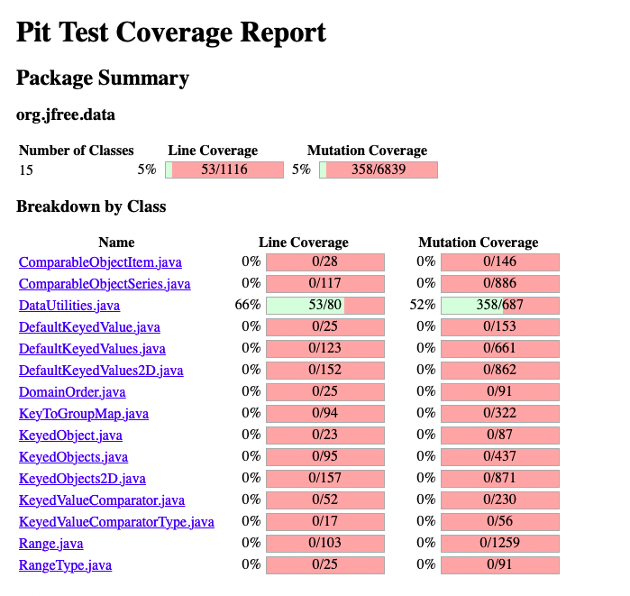
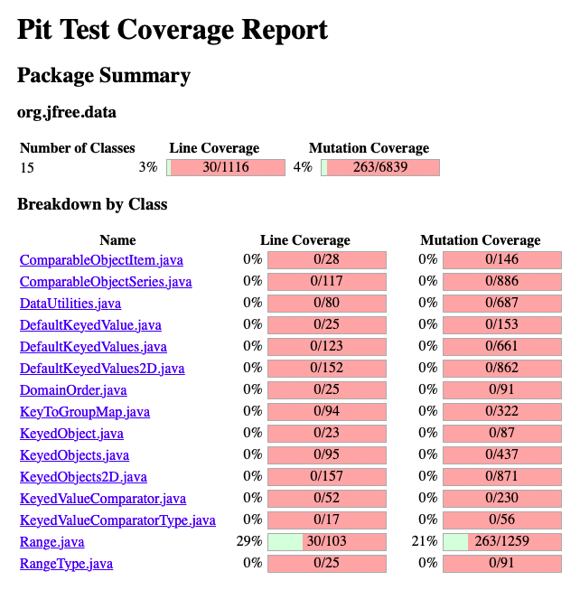
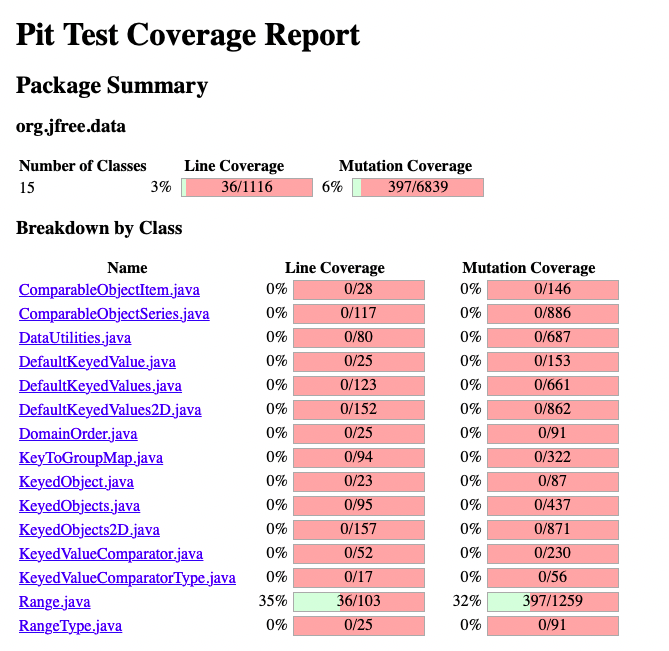

**SENG 438 - Software Testing, Reliability, and Quality**

**Lab. Report \#4 – Mutation Testing and Web app testing**

| Group \#:       | 30  |
|-----------------|---|
| Student Names:  | Agam Aulakh  |
|                 | Melanie Nguyen  |
|                 | Heidi Schaefer  |
|                 | Jeff Roszell  |

# Introduction
In this lab, mutation testing was performed on Range and DataUtilities classes from previous labs. Mutations were injected using the Pitest plug in for Eclipse. From these mutations, we were able to design new test cases to increase coverage of the SUT. GUI testing was also performed using Selenium plug in for Google Chrome. The SportChek website was tested for bugs using record and replay functionalities of this plug in. Selenium was also compared with another GUI testing tool, Sikulix.

# Analysis of 10 Mutants of the Range class
| Mutation Number | Mutation Description | Killed/Survived | Analysis |
|---|---|---|---|
| 1 | pre-increment/decrements |  killed in all methods | The mutations that changed local variables using pre incrementing operators were all killed because they would return incorrect values. |
| 2 | post-increment/decrements | survived | These mutations first fetched the correct values from fields in the methods and then performed an increment/decrement operation. Initially, we did not perform a second assert to check for changes in object fields as we found it to be redundant; however, in order to increase pit mutation test coverage, we had to perform double asserts. |
| 3 | checking for null inputs in Range class |  killed in almost all methods | These mutations would remove the check for null inputs, but as we specifically tested with null ranges, we were able to kill them. |
| 4 | methods that remove local variables | killed in all methods | This mutation removed local variables from the SUT/replaced them with NaN values, however, as they were required for accurate calculations, the error was detected by our test suite. |
| 5 | changing allowZeroCrossing in shift() from Range class | killed by tests | Our test suite included methods that specifically tested for zero crossing, and when the boolean was flipped, the wrong values were returned to the test cases and the assert call failed. |
| 6 | changing a comparison operator in calculateColumnTotal | survived | This method in the SUT uses for loop with a comparison operator while iterating through the COLUMNS of the input Values2D object. If this comparison operator is flipped, the for loop does not run as intended. In order to kill this mutation, we had to write a test case that was expected to fail the for loop condition (and only pass if the mutation existed). |
| 7 | changing a comparison operator in calculateRowTotal | survived | This method in the SUT uses for loop with a comparison operator while iterating through the ROWS of the input Values2D object. If this comparison operator is flipped, the for loop does not run as intended. In order to kill this mutation, we had to write a test case that was expected to fail the for loop condition (and only pass if the mutation existed). |
| 8 | checking for null elements in 2D input array in clone() from the DataUtilities class | survived | While we considered passing null values when testing this method, our test suite did not include objects with null elements. Therefore, when the SUT was mutated to not have the null check, the mutation survived, and our test suite had to be updated. |
| 9 | removing calls to class functions | killed in almost all test methods | When a mutation that removed a call to a class function was added to the SUT, the wrong value was returned/an exception was thrown. This was caught by our assert statements. |
| 10 | initializing for loop iterators with the wrong starting value | killed in all test methods | Mutations that changed the initial value of for loop iterators were caught by our test suite. This is because they would return incorrect values that would be caught by our assert statements. |

# Report all the statistics and the mutation score for each test class

## Data Utilities
#### Before Adding New Test Cases

#### After Adding New Test Cases

## Range
#### Before Adding New Test Cases

#### After Adding New Test Cases

# Analysis drawn on the effectiveness of each of the test classes
The initial DataUtilities test class had a line coverage of 45% and a mutation coverage of 38% (261/687). After the addition of more test cases to kill mutants, line coverage and mutation coverage both increased by over 10%. Mutation coverage increased to 52% (an increase of 14%), which meant that the test class was more effective at identifying mutants and killing them. This helps to ensure that more weaknesses and potential defects in the code were identified by the test class.

The initial Range test class had a line coverage of 29% and a mutation coverage of 21%. Upon improving the test class, mutation coverage improved to 32% and line coverage improved to 35%. This increase in mutation coverage means the test class became more effective at identifying potential defects in the code.

However, the test class is still far from being fully effective and achieving 100% coverage. One of the reasons is due to the test class only addressing five methods in the Range and DataUtilites classes rather than all of the methods.

The Range class initially had a lower pit mutation test coverage because three of the five methods under test were class getters, namely: getUpperBound, getLowerBound, and getLength. These were one-line methods and could not have been tested with a large number of mutations. While we were able to fully test these methods, the number of killed mutations did not contribute significantly to the total metrics.

# A discussion on the effect of equivalent mutants on mutation score accuracy
The mutants that are considered to be equivalent result in the same behaviour from the SUT. Adding multiple equivalent mutants would result in redudancy, as if one mutant survives, the rest will too, and this will significantly decrease the overal mutation accuracy score. Having equivalent mutants will impact the accuracy of the mutation tests. If teams simply increase the number of mutants without filtering the equivalent ones, they may falsely assume their code is correct and of high quality. Mutation classification, which is similar to equivalence class testing, may be performed to avoid this problem.

# A discussion of what could have been done to improve the mutation score of the test suites

As hinted in previous sections, we had to include more methods in our test suite to catch mutations. Specifically, we caught post-increment and -decrement by using adding more assert statements. After calling one method, we would assert the returned value is what we expect, and then use the class getters to detect if the object fields had changed.

In the range class, our tests for shift did not include null input parameters, and therefore, we had to write one to catch mutations in the SUT. As this method uses ParamChecks to ensure the base range is not null prior to shifting, it was important to test cases where a null range is used.

Other changes implemented to increase the mutation scores can be seen in the DataUtilities test class. For both calculateColumnTotal() and calculateRowTotal(), the SUT used a for loop to iterate through the input object. Our test cases could not identify the mutation that changed the comparison operator that was used to terminate the for loop. We had to include additional test cases that would send a mocked object with incorrect values and, under normal conditions, the methods would never enter the for loop with this object. Instead, it would return zero. With this, we could clearly check for when the comparison operator had been mutated, as a value other than zero would be returned.

We also had to include a test case that would pass a double array with null elements when testing the clone() method. Although our test suite included passing null input parameters, we did not specifically test the behaviour of the SUT when an object with null elements/fields was passed.

# Why do we need mutation testing? Advantages and disadvantages of mutation testing

### Need for mutation testing:
We need mutation testing to ensure our test cases catch faults that are not typically considered in other white- or black-box testing techniques. If source code is changed, the test result should also change.

### Advantages:
- Good quantitative analysis of the quality of test suite
- Easy to identify tests to edit after receiving mutation test results
- Introduce test cases that are not considered by other testing methods

### Disadvantages:
- Computationally very expensive
- Caused our IDEs to crash multiple times
- Sometimes highlight redundant faults (ie. many equivalent cases are tested)

# Explain your SELENIUM test case design process
To create our test cases, we simply walked through unique functionalities as a regular user would do if they were navigating through the SportChek website. For each page, we created two separate tests for slightly different functionalities.

### TC1 - Login/Account
The login process is a typical test case as there are many ways the output can differ based on the input. An account was initially created as both its own test, and to complete testing for login purposes. The account was used to successfully log in, and an incorrect attempt was made as well.

### TC2 - Search Functionality
One of the main functions of a shopping website is the search functionality. For this test, we searched for an item that exists on the site, and an item that does not exist on the site.

### TC3 - Cart Functionality
For this test, items are first added to the cart, then in another test they are removed.

### TC4 - Browse Jerseys
For this test, we navigated to the "Jerseys & Fan Wear" section of the site, and used the filter and next page functionalities.

### TC5 - Viewing FAQ's
The FAQ page contains many avenues to explore. For the test purposes, we tested the button/link to shipping details and also the tracking order. As well each page would be scrolled upon to get to the appropriate button. Then the final page was scrolled as well to ensure proper filling of all pages.

### TC6 - Store Locator
The store locator takes a variety of inputs into its main objective functional query box. We decided that provine a valid and invalid input would suffice. The resulting page would be scrolled in order to ensure no bugs.

### TC7 - Browse Wellness
For this test, we browse to the Wellness section and use the sort by and show in stock functionalities.

### TC8 - Triangle Rewards
For this test, we navigate to the external Triangle rewards site, and from there go to the "learn more" page, and their YouTube page.

# Explain the use of assertions and checkpoints
Assertions and verification checkpoint are used to validate test cases by comparing inputs against expected values. Typically, assertions are used to check conditions that must past the test in order to proceed onto the next step . If the assertion fails, the test case would stop its execution and the following steps in the test case wouldn't run.  In testing websites, assertions can be used to ensure that an input or element is correct before proceeding. For example, asserting whether a button is pressed before opening a new page.  

Verification checkpoints, unlike assertions, don't stop executing a test case if a checkpoint fails. The failure is noted, and the test continues its execution.  Due to this, checkpoints are used to execute conditions whose outcomes don't affect the following statements. As well, it's used to execute  the entire test case regardless of whether the checkpoint passed or failed. In testing websites, checkpoints can be used to verify elements on a page, such as page title, which can change without impacting other website functionalities.

# How each functionality was tested with different test data

TC1 - Testing with correct details, and invalid account details, successful and unsuccessful login

TC2 - Testing with valid and invalid search criteria

TC3 - Testing interactions of both adding items and removing items

TC4 - Used different filters in order to see changes in the browsable items

TC5 - There were multiple FAQ button links followed

TC6 - There was invalid and valid inputs used for the store locater

TC7 - Used different sorting parameters and filters

TC8 - Navigated from triangle rewards page to internal pages and external hosted media (YouTube)

# Discuss advantages and disadvantages of Selenium vs. Sikulix

Selenium
Pros:
Very easy to automate the tests
Very easy to alter values with tests that depend on them
Accepted on most major browsers
Cons:
Has problems with some types of addon/extension such as flash, shockwave
Is limited to browser testing of UI
No desktop support

Sikulix
Pros:
Scalability of visual matching (perfect to similar)
Testing is based on visual likeness, and therefore can support many more applications such as desktop and applications
Can also testing more functionality that isn't possible with script based testing (Selenium)
Cons:
More involved to setup
Does not test how we arrive at the given "visual environment"
Cannot test some functionality of scripts if there is no visual representation attached to it
Some GUI elements are not measured/captured, i.e. load times

# How the team work/effort was divided and managed
Initially we planned to divide up the work on the equally, however it became more of a group effort, with members contributing where they could, when they could. Due to lab issues and timing issues, we had to adjust our approach. Therefore as we moved through the lab, some members had larger commitments in certain areas and other areas were tackled by the remaining members.

# Difficulties encountered, challenges overcome, and lessons learned

Difficulties/Challenges/Lessons of Mutation Testing Portion

The major difficulty if the mutation testing was of course, getting the software to work. However, we also found that being aware of certain equivalent mutations was key even though it sometimes was elusive. Additionally, the PitTest plugin that we used for the mutation testing, has some quirkiness and specific concessions that you need to be aware of while using it. For example something as benign as incrementing. We found that it forced the incrementation to be post, and therefore we needed to continuously adjust the tests dependant on that functionality.

Difficulties/Challenges/Lessons of UI Testing Portion

The UI testing had a very minimal learning curve. The challenge came with verifying the input to ensure good UI coverage of all of the elements. There is a difficulty that may arise such as the behaviour of UI may change depending on the traffic or other factors. Additionally, we found that there were certain elements (flash) which were not supported by the plugin we used primarily (selenium). This could cause some grief, because in order to achieve good UI coverage, you would have to search out and learn another UI testing framework. The second plugin we used, also proved to be quite a bit more involved to setup, however it did provide us with more options as to what it could test. We were also able to notice some tuning of the fidelity of the tests, which could allow for tolerance of the end product. This is something which could be useful depending on the scenario.

# Comments/feedback on the lab itself
This lab, when working, was a good exposure to industry tools used in GUI testing. Also we were exposed to mutation testing however there were quite a few problems with the lab content and some of were never able to get total functionality out of the lab. If the issues are worked out, this will surely be an informative lab.
